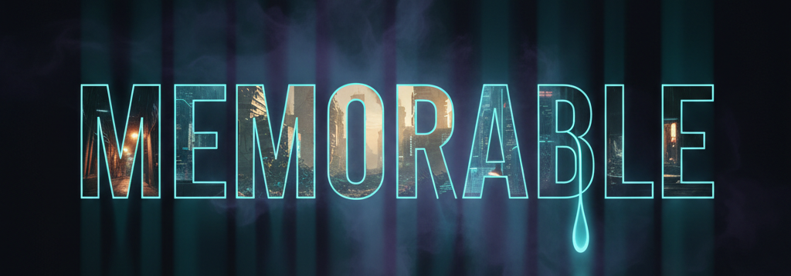

<div align="center">
  
  
  # MEMORABLE

  **A Cyberpunk Interactive Fiction powered by PyGame and Generative AI**

  *Final Project for Stanford Code in Place 2026*

  <br>

  [](https://www.youtube.com/watch?v=4Hm4geftQNo&autoplay=1)
</div>

---

## 📖 About The Project

**MEMORABLE** is a rich, pure-Python interactive fiction game set in the dystopian neon-lit streets of Nova City. You play as Ash Verlaine, a memory trafficker caught in the web of an omnipresent AI governor known as MNEMOS. 

Instead of traditional static branching storylines, the game utilizes **Generative AI (Groq API + Qwen3)** to dynamically synthesize dialogue and generate bespoke endings based on the exact moral choices (Empathy, Rebellion, Cynicism, Control) the player makes throughout their journey.

### 🌟 Key Features
- **Pure Python Desktop App:** Built entirely using `pygame`, proving the power of Python without relying on browser engines or external rendering frameworks.
- **Dynamic AI Dialogue:** Deep integration with the Groq API allows the antagonist, MNEMOS, to dynamically respond to the player's specific moral alignments in real-time.
- **Custom Post-Processing:** Features high-quality cyberpunk visual effects such as CRT scanlines, chromatic aberration, flickering UI, and matrix-style raining particle systems.
- **Immersive Audio Engine:** A custom-built asynchronous audio engine handles overlapping ambient rain, synthwave soundtracks, and dynamic typing sound effects that react to punctuation pauses.
- **Graceful Degradation:** If the player lacks internet access or the AI API fails, the engine seamlessly falls back to pre-written hardcoded dialogues without interrupting gameplay.

---

## 🎮 How To Play (Easiest Way!)

Don't want to mess with Python environments? No problem! 
You can play the fully compiled Desktop `.exe` version of the game immediately without installing anything.

1. **Download the Game:** [Download game.exe from GitHub Releases](https://github.com/Yaser-123/Memorable/releases/download/v1.0.0/game.exe) OR [Download from itch.io](https://t-mohamed-yaser.itch.io/memorable)
2. **Run:** Double-click the downloaded `game.exe` file.
3. **Play:** A popup window will ask for your Groq API Key. Paste it in, and the game will launch with full audio and AI features!

---

## 🛠️ How To Run Locally (Source Code)

Follow these steps to run the game on your own computer:

### 1. Prerequisites
Ensure you have Python installed (Python 3.10+ recommended). You can download it from [python.org](https://www.python.org/).

### 2. Setup the Environment
Open your terminal or command prompt and clone/download this repository. Then, install the required dependencies:

```bash
# It is highly recommended to create a virtual environment first
python -m venv venv

# Activate the virtual environment
# On Windows:
venv\Scripts\activate
# On Mac/Linux:
source venv/bin/activate

# Install the required packages
pip install -r requirements.txt
```

### 3. API Key Configuration
The game uses the Groq API for dynamic AI dialogue generation. 
1. Get a free API key from [Groq Console](https://console.groq.com/).
2. In the root directory of the project, rename the `.env.example` file to `.env`.
3. Open the `.env` file and insert your API key:
   ```env
   GROQ_API_KEY=your_actual_api_key_here
   ```

### 4. Launch the Game
Once your environment is set up and your API key is inserted, simply run:

```bash
python game.py
```
*Tip: Put on headphones for the best immersive audio experience!*

---

## 👨‍💻 About The Author

**T Mohamed Yaser**
- **Email:** [1ammar.yaser@gmail.com](mailto:1ammar.yaser@gmail.com)
- **LinkedIn:** [https://www.linkedin.com/in/mohamedyaser08/](https://www.linkedin.com/in/mohamedyaser08/)

*This project was passionately developed as a capstone submission for Stanford Code in Place 2026. Special thanks to the teaching team and the amazing Python community!*
